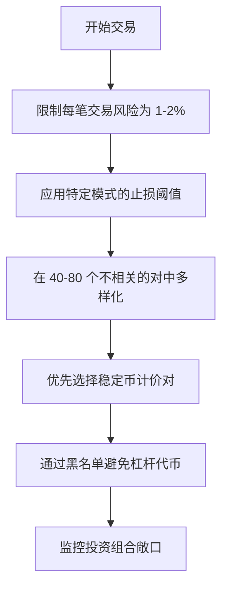
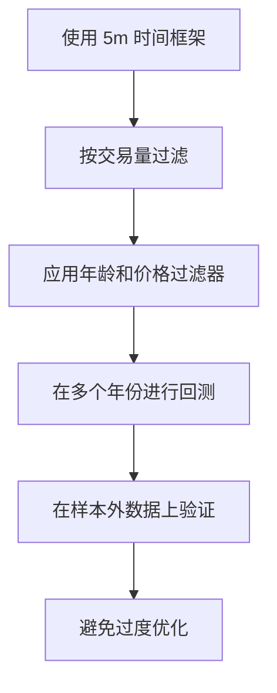
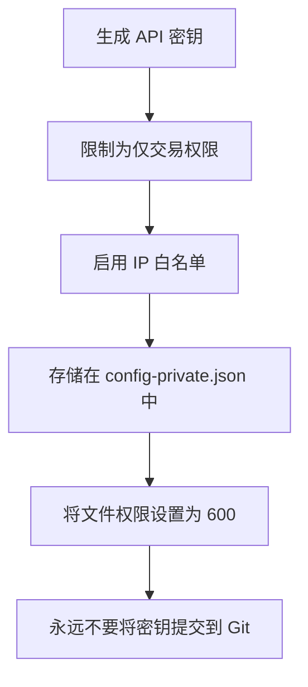

# 最佳实践指南

<cite>
**本文档引用的文件**
- [NostalgiaForInfinityX6.py](file://NostalgiaForInfinityX6.py)
- [recommended_config.json](file://configs/recommended_config.json)
- [trading_mode-spot.json](file://configs/trading_mode-spot.json)
- [pairlist-volume-binance-usdt.json](file://configs/pairlist-volume-binance-usdt.json)
- [blacklist-binance.json](file://configs/blacklist-binance.json)
- [README.md](file://README.md)

</cite>

## 目录
1. [风险管理原则](#风险管理原则)
2. [性能优化技术](#性能优化技术)
3. [监控和维护指南](#监控和维护指南)
4. [安全最佳实践](#安全最佳实践)
5. [心理学方面和干预协议](#心理学方面和干预协议)
6. [配置和实现指南](#配置和实现指南)

---

## 风险管理原则

在部署 NostalgiaForInfinityX6 策略时，有效的风险管理对于保护资本和确保可持续性能至关重要。必须严格遵守以下原则：

### 头寸规模

**永远不要在任何单笔交易中冒超过总交易资本的 1-2% 的风险。** 这种保守的方法确保即使一系列亏损交易也不会显著耗尽您的账户。例如，对于 $10,000 的账户，每笔交易的最大风险应限制在 $100–$200。

### 止损设置

该策略使用基于市场条件和交易模式的动态止损机制。关键阈值在配置中定义：
- **常规模式**: 现货和期货的止损阈值为 10%
- **末日模式**: 止损阈值增加到 20%
- **回购模式**: 止损阈值设置为 100%，允许战略性重新进入
- **快速和剥头皮模式**: 止损阈值为 20%

这些值通过参数配置，如 `stop_threshold_spot`、`stop_threshold_futures` 和特定模式的变体，如 `stop_threshold_rapid_spot`。

### 投资组合多样化

为了降低相关性风险，该策略应应用于 40–80 个不相关的加密货币对的多样化集合。稳定币计价对（例如 USDT、USDC）优于 BTC 或 ETH 对，以最小化对广泛市场波动的敞口。基于交易量的配对列表（例如 `pairlist-volume-binance-usdt.json`）有助于维护动态、高流动性的资产集合。



**本节来源**
- [NostalgiaForInfinityX6.py](file://NostalgiaForInfinityX6.py#L116-L173)
- [blacklist-binance.json](file://configs/blacklist-binance.json#L1-L21)

---

## 性能优化技术

优化 NostalgiaForInfinityX6 的性能涉及仔细选择时间框架、过滤低交易量资产以及避免回测期间的过度拟合。

### 时间框架选择

该策略设计为**仅在 5 分钟 (`timeframe = "5m`) 蜡烛上运行**。这个短期时间框架能够快速响应市场变动，但需要高频数据处理。使用任何其他时间框架可能会使信号逻辑失效并导致性能不佳。

### 低交易量对过滤

配置中使用 `VolumePairList` 确保仅交易最具流动性的对。例如，`pairlist-volume-binance-usdt.json` 按报价交易量选择前 80–100 个对，每 30 分钟刷新一次。这减少了滑点并改善了执行质量。

### 避免过度拟合

回测必须在多个市场周期和不同条件下进行。该存储库包括全面的回测脚本（例如 `backtesting-all.sh`、`backtesting-analysis.sh`），可在所有年份和对中测试性能。为了防止过度拟合：
- 使用前向走测分析
- 在牛市、熊市和横盘市场中测试
- 在样本外数据上验证结果
- 避免过度参数优化



**本节来源**
- [NostalgiaForInfinityX6.py](file://NostalgiaForInfinityX6.py#L140-L145)
- [pairlist-volume-binance-usdt.json](file://configs/pairlist-volume-binance-usdt.json#L2-L40)

---

## 监控和维护指南

适当的监控和定期维护对于 NostalgiaForInfinityX6 策略的可靠运行至关重要。

### 干运行模式

**始终以至少两周的干运行（纸质交易）模式开始。** 这允许您验证交易执行逻辑、监控信号频率并评估风险敞口，而无需财务风险。在观察到一致的性能之前，在配置中设置 `"dry_run": true`。

### 交易执行警报

为进入和退出信号设置实时警报。这可以通过 Freqtrade 的消息系统（Telegram、Discord 等）实现。即时通知可以进行手动验证和必要时的干预。

### 日志审查

定期审查策略日志以检测异常、失败的 API 调用或意外行为。日志存储在 `user_data/logs/` 目录中，应在实时交易期间每天检查。

### 代码库更新

该策略得到积极维护，更新可能会引入新功能或错误修复。定期从存储库拉取最新版本，并在部署前在干运行模式下测试更改。

### 参数审查

市场条件不断演变，静态参数可能变得次优。每周或每月安排一次关键设置的审查，如止损阈值、投注倍数和配对列表过滤器，以确保与当前波动性和趋势保持一致。

**本节来源**
- [NostalgiaForInfinityX6.py](file://NostalgiaForInfinityX6.py#L__init__)
- [recommended_config.json](file://configs/recommended_config.json#L10-L18)

---

## 安全最佳实践

在运行与交易所 API 交互的自动化交易系统时，安全至关重要。

### API 密钥权限

使用具有最少所需权限的 API 密钥：
- **仅**允许交易操作
- 完全禁用提现权限
- 启用 **IP 白名单**以限制 API 访问到受信任的服务器
- 为不同的机器人或环境使用单独的密钥

### 安全的密钥存储

**永远不要在配置文件中以明文形式存储 API 密钥。** 相反：
- 使用 `config-private.json` 存储敏感数据
- 在环境变量或加密保险库中存储密钥
- 确保文件权限限制访问（例如 `chmod 600 config-private.json`）

### 交易所配置

`recommended_config.json` 中的 `ccxt_config` 包括除非明确需要，否则应保持未设置的代理选项。避免暴露不必要的端点或合作伙伴 ID。



**本节来源**
- [recommended_config.json](file://configs/recommended_config.json#L1-L18)
- [NostalgiaForInfinityX6.py](file://NostalgiaForInfinityX6.py#L__init__)

---

## 心理学方面和干预协议

自动化交易消除了情感决策，但人工监督仍然至关重要。

### 有纪律的干预

定义明确的手动干预规则：
- 仅在极端市场事件期间干预（例如闪崩、交易所中断）
- 永远不要基于情感覆盖止损或退出信号
- 维护所有干预的日志以进行事后分析

### 避免过度优化偏差

抵制在每次亏损后不断调整参数的诱惑。该策略被设计为具有亏损交易作为其统计优势的一部分。专注于长期预期而不是短期结果。

### 保持流程纪律

遵循一致的操作例程：
- 每日日志审查
- 每周性能评估
- 每月参数审计
- 季度策略健康检查

这种结构化方法可防止反应性决策并支持长期成功。

**本节来源**
- [README.md](file://README.md#L15-L30)
- [NostalgiaForInfinityX6.py](file://NostalgiaForInfinityX6.py#L130-L135)

---

## 配置和实现指南

要正确实现 NostalgiaForInfinityX6 策略，请遵循存储库中提供的配置结构。

`recommended_config.json` 作为基础配置，包括：
- 策略名称：`"NostalgiaForInfinityX6"`
- 通过 `add_config_files` 的模块化配置，结合：
  - 交易模式（现货/期货）
  - 动态配对列表
  - 交易所特定的黑名单
  - 核心和密钥设置

配置结构示例：
```json
{
  "strategy": "NostalgiaForInfinityX6",
  "add_config_files": [
    "../configs/trading_mode-futures.json",
    "../configs/pairlist-volume-binance-usdt.json",
    "../configs/blacklist-binance.json",
    "../configs/exampleconfig.json",
    "../configs/exampleconfig_secret.json"
  ]
}
```

确保：
- `use_exit_signal = true`
- `exit_profit_only = false`
- `ignore_roi_if_entry_signal = true`
- 时间框架保持在 5m
- 黑名单定期更新

有关实现详情，请参考[配置](#配置和实现指南)、[交易模式](#性能优化技术)和[回测](#性能优化技术)部分。

**本节来源**
- [recommended_config.json](file://configs/recommended_config.json#L1-L18)
- [trading_mode-spot.json](file://configs/trading_mode-spot.json#L1-L6)
- [README.md](file://README.md#L20-L30)

---

## 总结

遵循这些最佳实践将帮助您：
- ✅ 有效管理交易风险
- ✅ 优化策略性能
- ✅ 确保系统安全性
- ✅ 维持长期的交易纪律
- ✅ 实现可持续的交易成功

**最后更新**: 2026-01-27
**版本**: 1.0 (中文翻译)
